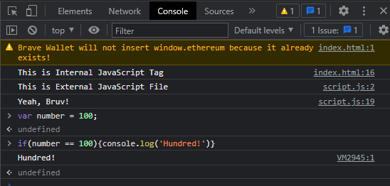

# 2 Ways to Add JS to HTML

 ```js
 // This is how to comment in JavaScript
 ```

 `console.log()` prints out its statement. It helps in debugging process especially in testing the outcome of declared variables.

 `var` is a variable that can stores any value. It basically is a container that typically used to store number, string, boolean value.

 ```js
//  This is JS File
 var number = 10;
 var string = 'Hello World';
 var isJS = True;
 ```

## 1. Internal Script Tag

 Insert a Script tag inside Body tag.

 ```js
 //  This is JS File
    <script>
        // This is a comment
        // console.log() prints statement.
        console.log('hello');
    </script>
 ```

## 2. External JavaScript File

 Create an external JavaScript File with arbitraryName.js in any directory you want. Then refer it via a Script tag in the Body tag.

 For example,

 ```html
 <!-- This is HTML Page -->
 <script src="./script.js"></script>
 ```

 ```js
 // This is JavaScript File 
 console.log('This is External JavaScript File');
 ```

 We can declare variables in JS file and store them in HTML via ID. Afterwards, we can call these by `document()` method.

 ```html
 <!-- This is HTML page in Body tag -->
 <div id="box"></div>
 ```

 ```js
 // This is JS File 
 var number = 10;
 var string = 'Hello World';
 var isJS = True;

 // document() method to call the variable var stored in HTML
 // box is the ID used in div tag inside HTML
 // We also need to set the innerHTML to String.  
 document.getElementById('box').innerHTML = string;
 ```

 By using `document()` method, we can also apply arithmetic and comparison operations. View the example below for arithmetic operation:

 ```js
 // This is JS File
 document.getElementByID('box').innerHTML = number + 20;
 ```

### Conditional Statement in JavaScript

 Ontop of that, we can also run conditional statement in JS. Let say, if a condition is met, we want to run scenario A. Otherwise run scenario B. Look at the example below:

 ```js
 // This is JS File
 // Read Output under Console in Developer Tool of the Webbrowser 
 if(variable == condition){
    console.log('Scenario A');
 }  else {
    console.log('Scenario B');
 }
 ```

 *Trivia*: We can also run JavaScript inside the Console in the Developer Tool!
 <!-- Add Image in Markdown -->
 <!-- . -->

 

### Loop in JavaScript

 Loop is simply how we run certain code multiple times.

* For Loop

    ```js
    // Output in Console
    // Loop Syntax
    /*
    for(variable variableValue; condition; iteration){
        console.log(variableValue);
    }
    */
    for(var i=0; i < 10; i++){
        console.log(i);
    }

    ```

    Here's the Output:

    

* Array Loop

    ```js
    var car = ['Lambo', 'Koenigsegg', 'Porsche'];
    for(var i=0; i < car.length; i++){
        console.log(car[i]);
    }

    ```

    Here's the Output:

    

### Function in JavaScript

 In short, function let you give input, processed it and give back the output. It is useful in making the script modular and clean as we can write it one time, and call it multiple times within the function visibility.

 For example, if function is a vending machine, you can insert money into the machine, press selection button for the desired item(s) and it will eject the item(s) if enough money inserted.

 In JS, it is called `function()` method. It remains passive until it is called by the script. Seeing is believing:

 ```js
 // First declare the Array
 var superbike = ['Yamaha R1', 'Kawasaki Ninja zx10r', 'Suzuki Hayabusa'];
 // Here we declare the function
 function listSuperbike(){
    for(i=0; i < superbike.length; i++){
        console.log(superbike[i]);
    }
 }

 // Here we call the function superbike()
 listSuperbike();
 ```

 Here's the Output in Dev Console:

 _in_JS.PNG "Function() Output in Dev Console")  

### Event Listener in JavaScript

 We did declare a Div tag with IDs: box1 & box2 at the beginning in the HTML Body tag. They print out:

 `Hello World, this is how we call a variable value in JS.`

 and

 `20` respectively. But nothing happen if we click or hover the mouse over these outputs.

 This is where `Event Listener()` method shines. The syntax is as follows:

 ```js
 document.getElementById('ID').addEventListener('click', function(){
    alert('I was clicked and baited, gotcha Clickbait!');
 });
 ```

 This way, whenever we clicked the ID Output on the HTML page, an alert pop up will be triggered as depicted below:

  popup in HTML Page")

## Conclusion

 These are the basic overviews for Introduction to JavaScript for beginner to get started.

 Visit [Web3SChools](https://www.w3schools.com/) for more lessons in HTML, CSS and JavaScript. You will love it!

|￣￣￣￣￣￣￣￣￣￣￣￣￣|

          Your work matters,
      Even if it never goes viral! 
|＿＿＿＿＿＿＿＿＿＿＿＿＿|

                     \ (•◡•) / 
                      \      / 
                       —————
                       |    |
                       |_   |_
